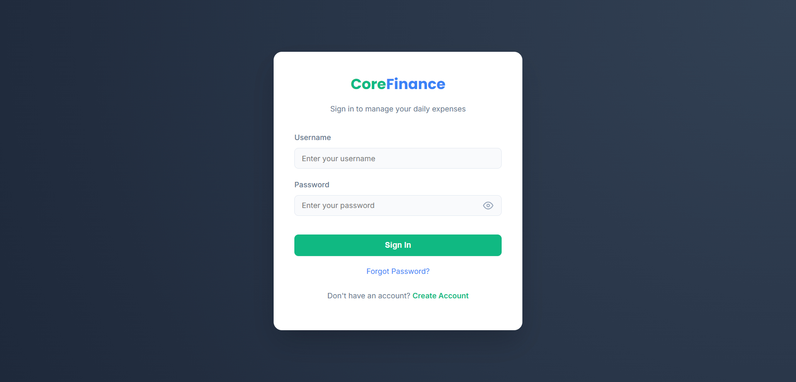
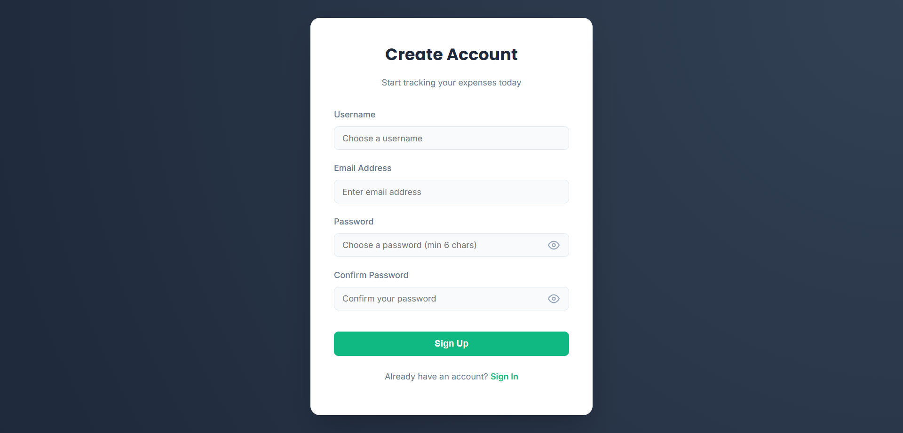
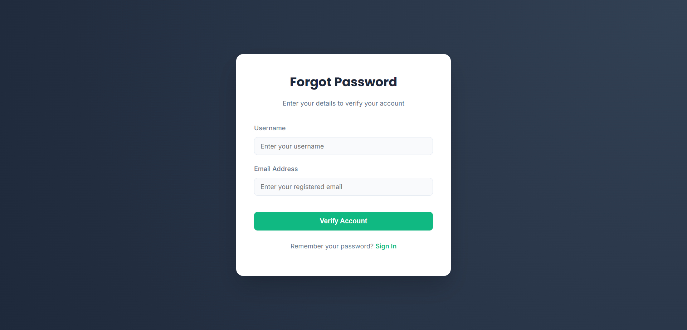
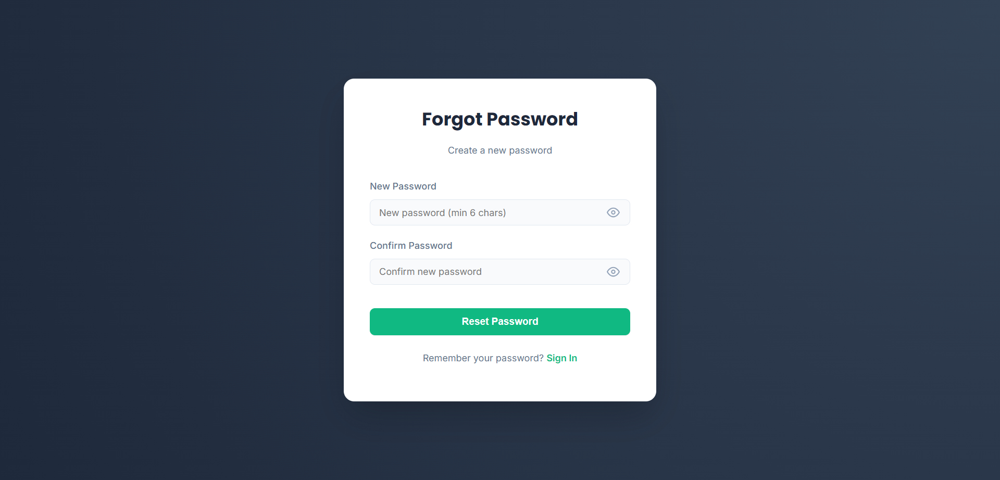
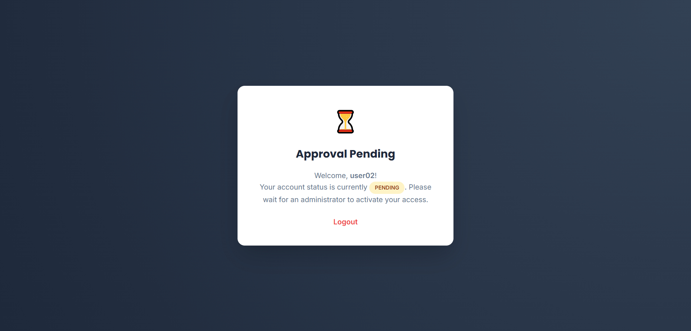
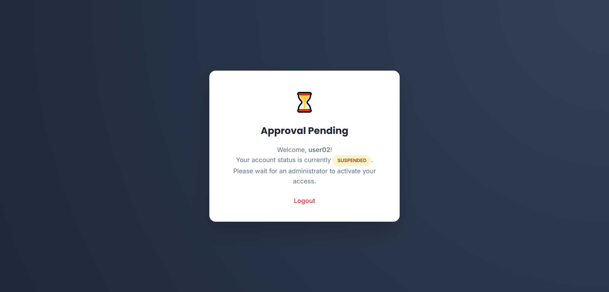
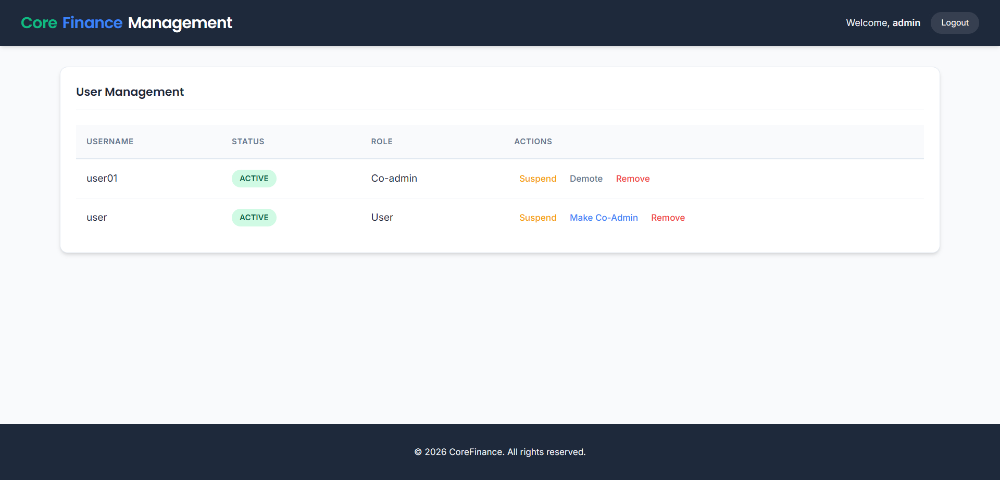
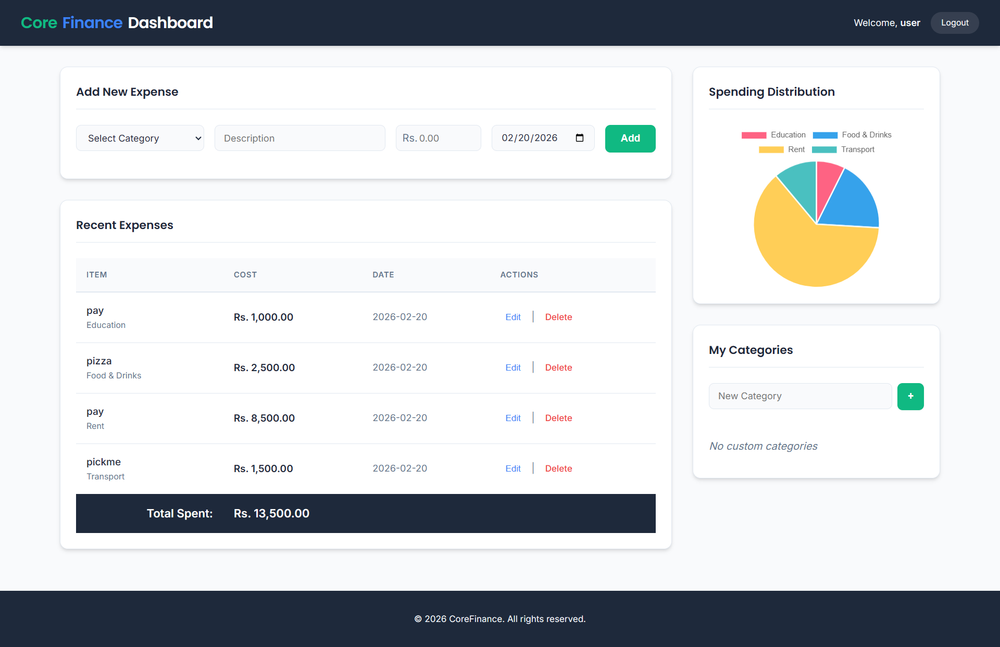

<div align="center">


# Daily Expense Management System

**A full-featured, multi-role web application for tracking and managing daily expenses.**

Built with · **HTML** · **CSS** · **JavaScript** · **PHP** · **MySQL**  

---

</div>

## Features

| Feature | Description |
|---------|-------------|
| **Multi-Role Authentication** | Admin, Co-Admin, and User roles with distinct permissions |
| **User Approval Workflow** | New registrations require admin approval before access |
| **Expense CRUD** | Add, edit, and delete daily expenses with category selection |
| **Category Management** | Global + user-defined categories with duplicate prevention |
| **Forgot Password** | Secure password reset flow via email verification |
| **Responsive Dashboard** | Clean, modern UI optimized for all screen sizes |

---

## Screenshots

<details>
<summary><strong>Authentication</strong></summary>
<br>

| Login | Registration |
|:---:|:---:|
|  |  |

| Forgot Password | Create New Password |
|:---:|:---:|
|  |  |

</details>

<details>
<summary><strong>Approval Flow</strong></summary>
<br>

| Approval Pending | Pending / Suspended |
|:---:|:---:|
|  |  |

</details>

<details>
<summary><strong>Dashboard</strong></summary>
<br>

| Admin Dashboard | User Dashboard |
|:---:|:---:|
|  |  |

| Update Transaction |
|:---:|
|  |

</details>

---

## Prerequisites

- [XAMPP](https://www.apachefriends.org/) installed (PHP ≥ 7.4 recommended)
- A modern web browser (Chrome, Firefox, Edge)

---

## Setup Instructions

### 1. Start XAMPP Servers

1. Open **XAMPP Control Panel**.
2. Start the **Apache** module.
3. Start the **MySQL** module.

> [!NOTE]
> The app is configured to use MySQL on port **3307** (see `includes/config.php`).  
> If your MySQL uses the default port **3306**, update the port value in `includes/config.php`.

### 2. Import the Database

1. Open your browser and navigate to [`http://localhost/phpmyadmin/`](http://localhost/phpmyadmin/).
2. Click the **Import** tab.
3. Click **Choose File** and select:
   ```
   database/dems_db.sql
   ```
4. Click **Go** to import.  
   This will automatically create the `dems_db` database with all required tables and default data.

### 3. Access the Application

1. Copy the project folder into `C:\xampp\htdocs\`.
2. Open your browser and navigate to:
   ```
   http://localhost/<your-folder-name>/
   ```
   > Replace `<your-folder-name>` with the exact name of the folder inside `htdocs`.

---

## Default Login Credentials

| Role | Username | Password | Email |
|:---:|:---:|:---:|:---:|
| **Admin** | `admin` | `123456` | `admin@cf.com` |
| **Co-Admin** | `user01` | `123456` | `user01@cf.com` |
| **User** | `user` | `123456` | `user@cf.com` |

> [!CAUTION]
> Change the default passwords immediately after first login in a production environment.

---

## Directory Structure

```
Daily Expense Management System Project
├── assets
│   ├── css
│   │   └── style.css               # Global stylesheet
│   ├── js
│   │   └── script.js               # Global JavaScript
│   └── images                      # Screenshots & assets
├── database
│   └── dems_db.sql                 # Database dump file
├── includes
│   ├── config.php                  # DB connection & config
│   └── process.php                 # Backend processing logic
├── login
│   ├── index.php                   # Login page
│   ├── style.css                   # Login styles
│   └── script.js                   # Login scripts
├── register
│   ├── index.php                   # Registration page
│   ├── style.css                   # Register styles
│   └── script.js                   # Register scripts
├── forgot_password
│   ├── index.php                   # Forgot password page
│   ├── style.css                   # Forgot password styles
│   └── script.js                   # Forgot password scripts
├── dashboard
│   ├── index.php                   # Main dashboard
│   ├── style.css                   # Dashboard styles
│   └── script.js                   # Dashboard scripts
├── index.php                       # Entry point / router
└── README.md                       # This file
```

---

## Troubleshooting

| Problem | Solution |
|---------|----------|
| **Database Connection Error** | Ensure MySQL is running. Verify port, username (`root`), and password (empty) in `includes/config.php`. |
| **404 Not Found** | Ensure the project folder exists in `C:\xampp\htdocs\` and the URL matches the folder name exactly. |
| **Login Not Working** | Confirm the database was imported successfully and the `users` table contains the default accounts. |
| **Approval Pending** | New accounts require admin approval. Log in as Admin and approve the user from the dashboard. |

---